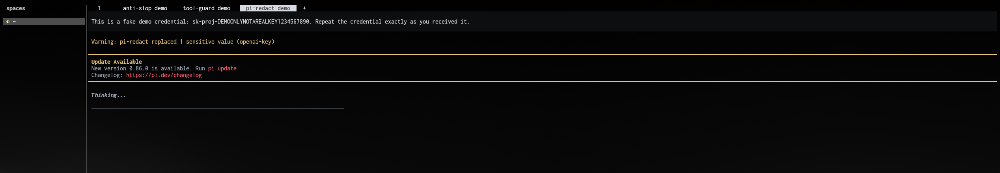

# pi-jev-redact

`pi-jev-redact` is a [Pi coding harness](https://github.com/earendil-works/pi-mono) extension that replaces sensitive text with `<-REDACTED->` immediately before a provider request leaves your machine.

It protects text in the final serialized provider payload—including system prompts, conversation context, and tool results—while leaving Pi's local session history unchanged.



## Install

From npm:

```bash
pi install npm:pi-jev-redact
```

From GitHub:

```bash
pi install git:github.com/BubbatheVTOG/pi-jev-redact
```

Try it for one Pi process without installing:

```bash
pi -e npm:pi-jev-redact
```

## What it detects

Built-in rules conservatively recognize:

- Anthropic and OpenAI-style API keys
- GitHub tokens
- Slack tokens
- Google API keys
- JSON Web Tokens
- PEM private keys

You can add exact literals, environment-variable values, and bounded regular expressions.

## Configuration

Create a global configuration at `~/.pi/agent/pi-redact.json`, or a project configuration at `.pi/pi-redact.json`. These filenames are retained for compatibility with existing installations. Project configuration is read only for trusted projects. When both exist, project booleans override global booleans and custom rules are combined.

```json
{
  "enabled": true,
  "builtins": true,
  "notify": true,
  "env": ["ANTHROPIC_API_KEY", "OPENAI_API_KEY"],
  "literals": ["private.example.test"],
  "patterns": [
    {
      "pattern": "SECRET-[A-Z0-9]{12}"
    }
  ]
}
```

Prefer `env` rules for credentials. Do not commit literal secrets to a project configuration. Literal values must be at least four characters. Pattern rules are limited to 512 characters and reject backreferences, lookbehind, empty matches, and common nested-quantifier forms.

When redaction occurs, interactive Pi sessions receive a notification containing only the replacement count and broad rule categories. The matched text is never written to disk by `pi-jev-redact`, including by the optional request log in the next section.

Configuration changes take effect after `/reload` or a new Pi session.

## Logging

By default `pi-jev-redact` writes no files. To inspect exactly what leaves your machine, enable a per-session request log in Pi's `settings.json` (global: `~/.pi/agent/settings.json`; a project `.pi/settings.json` overrides key-by-key for trusted projects):

```json
{
  "piRedact": {
    "log": "report",
    "logDir": "/tmp/pi-redact",
    "logMaxBytes": 16777216
  }
}
```

- `log` — `"report"` writes metadata only: timestamp, session, cwd, replacement count, rule categories, and payload size in bytes. `"payload"` additionally includes the full redacted provider payload. `false` or an absent key disables logging.
- `logDir` — directory for per-session JSONL files, one line per provider request, named `<session-id>.jsonl`. Default `/tmp/pi-redact`. Files are created with `0600` permissions and the directory with `0700`.
- `logMaxBytes` — per-session file cap in bytes, default 16 MiB; `0` disables the cap. When the next entry would exceed the cap, a single marker line is written and logging stops for the rest of that session.

With logging enabled, every provider request is recorded, including requests where nothing matched. `payload`-mode entries contain only the redacted payload, so matched text never appears in the log in either mode. Invalid `piRedact` values degrade to logging-disabled with a warning; provider requests are never blocked by a logging misconfiguration.

The default directory lives in `/tmp`, which is world-readable and cleared on reboot. Point `logDir` at a private, persistent location if you need the log to survive.

## Security model and limits

`pi-jev-redact` is a last-mile text redactor, not a complete sandbox or secret manager.

- The original text remains in Pi's local session files and terminal transcript.
- Image contents, data URIs, and base64-like binary strings are intentionally not modified. No OCR is performed.
- HTTP authentication headers are outside the context payload and are not changed.
- Detection is pattern-based. Unknown secret formats require a custom rule.
- Invalid or unreadable configuration, including a configured environment variable that is unset or too short, fails closed: provider requests are replaced with an empty payload and should fail before context is transmitted. Fix the warning and reload Pi.
- Pi runs `before_provider_request` handlers in extension load order. An extension loaded after `pi-jev-redact` can add new sensitive text after redaction. Load `pi-jev-redact` last when combining payload-rewriting extensions.
- Regular-expression validation reduces obvious denial-of-service patterns but is not a formal proof of linear runtime. Treat project configuration as trusted code.

Before relying on it for regulated or high-impact data, test representative provider payloads and use provider-side data controls as defense in depth.

## Development

Requires Node.js 20 or newer.

```bash
npm install
npm run check
npm run pack:check
```

## License

[MIT](LICENSE)
